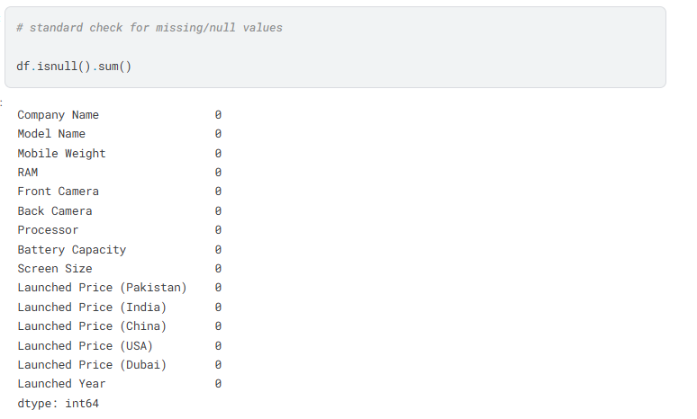
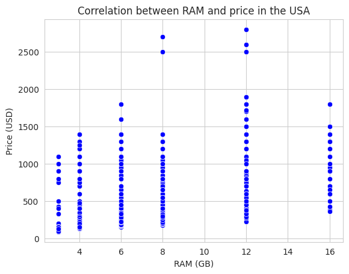
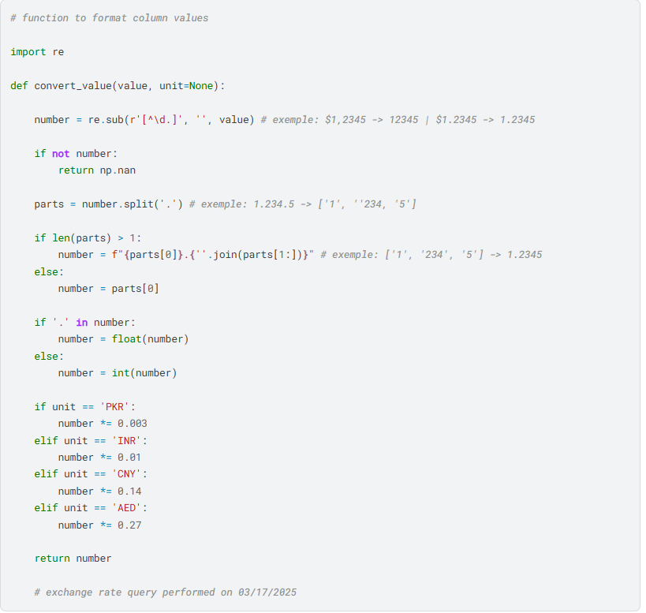
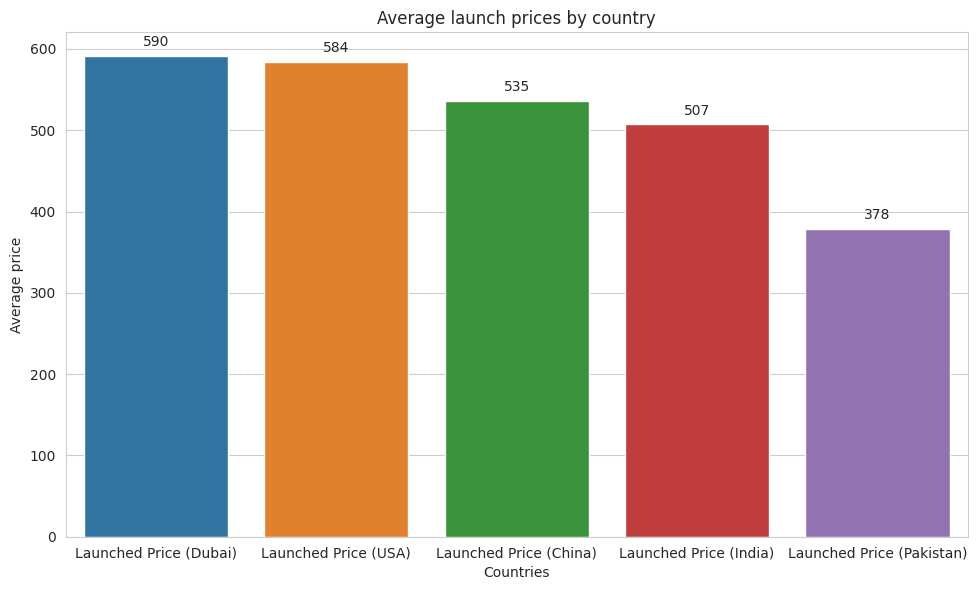
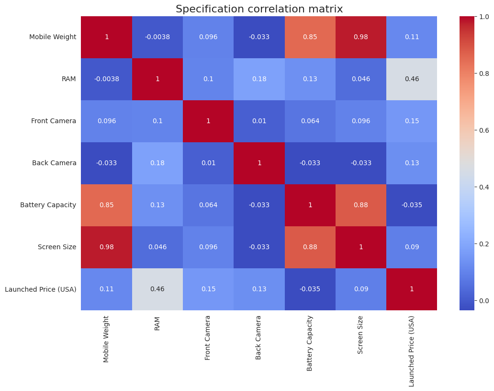
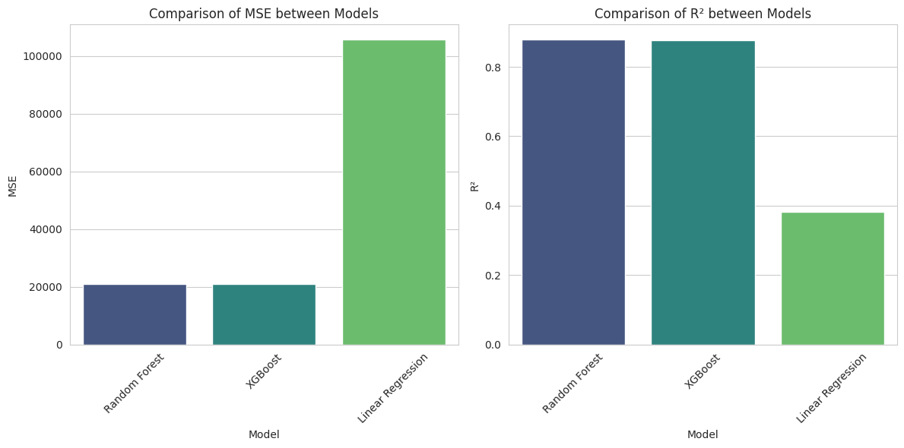

# 📱 Análise e Previsão de Preços de Dispositivos Móveis

## 🎯 Objetivo
Analisar fatores que influenciam o preço de dispositivos móveis e desenvolver um modelo preditivo para estimar valores com base em suas características.

## 🛠️ Pré-processamento e Manipulação dos Dados

### Verificando valores nulos

### Normalização da Coluna RAM

### Função de conversões para Dólar

*taxas de câmbio retiradas em 17/03/25*

## 📊 Análise Exploratória (EDA)

### Relação entre RAM e Preço

### Preços Médios por País

### Correlação entre Features

### Principais insights:

Peso vs Bateria/Tela: Correlação muito alta (0.85-0.98) - dispositivos maiores têm baterias maiores

RAM vs Preço (EUA): Correlação moderada de 0.46 - mais RAM geralmente significa preço mais alto

Câmera Traseira vs RAM: Correlação de 0.18 - dispositivos com mais RAM tendem a ter melhores câmeras

Bateria vs Preço: Correlação negativa (-0.035) - surpreendentemente, bateria maior não significa preço maior

## 🤖 Modelagem Preditiva

### Resultados dos Modelos

| Modelo | R² | MSE |
|--------|----|-----|
| **Random Forest** | **0.88** | **20.824** |
| XGBoost | 0.87 | 20.965 |
| Regressão Linear | 0.38 | 105.553 |

## 🛠️ Tecnologias Utilizadas
- Python
- Pandas, NumPy
- Scikit-learn
- Matplotlib, Seaborn
